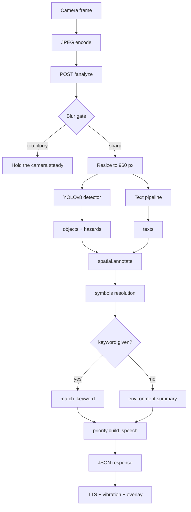
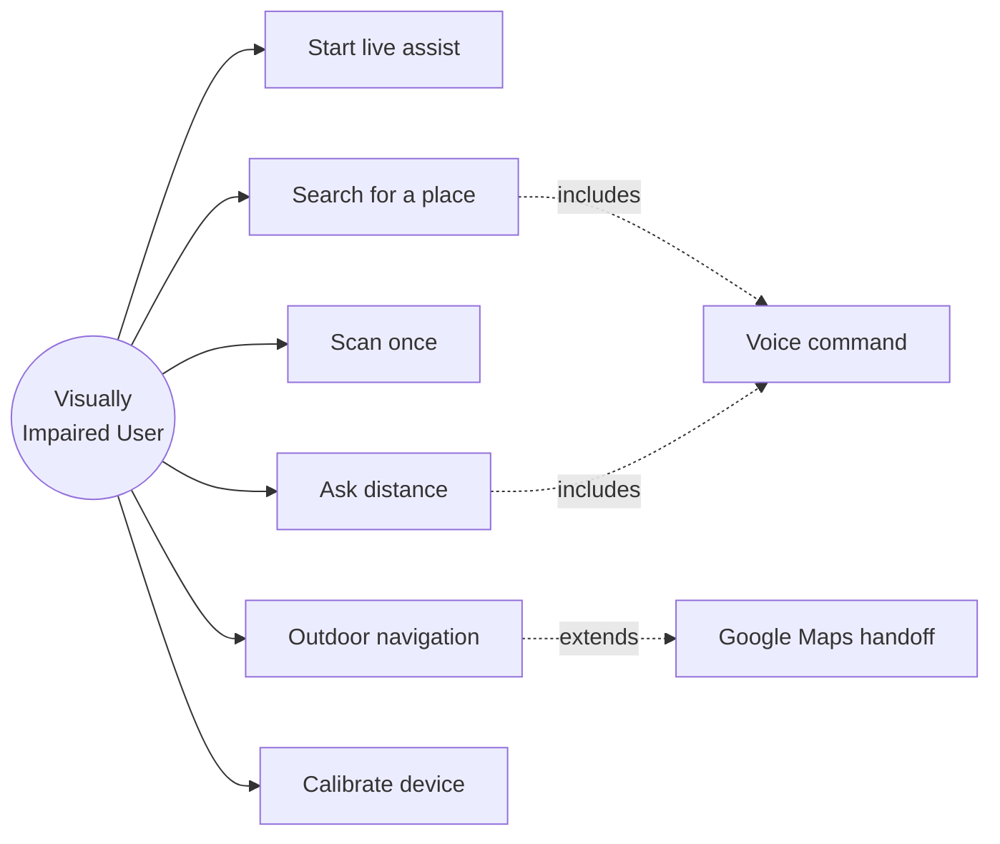
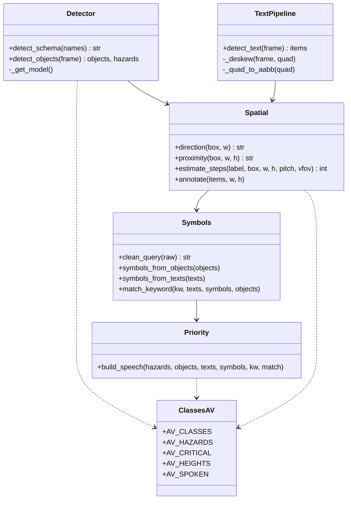
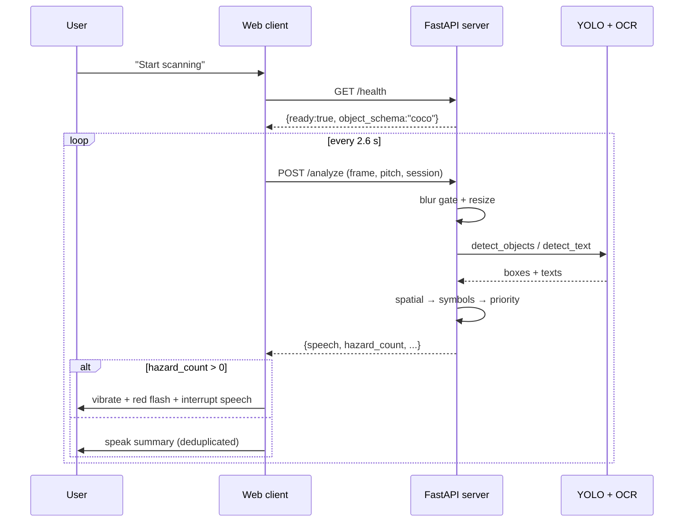
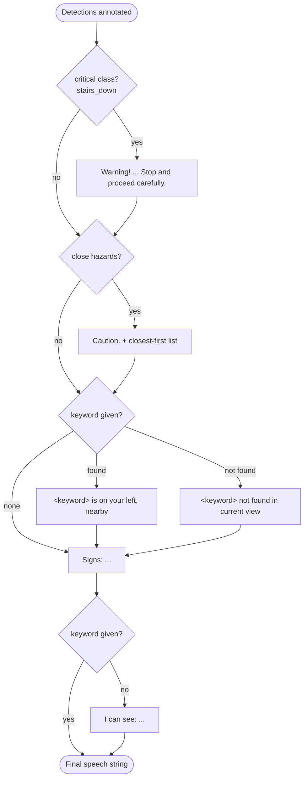
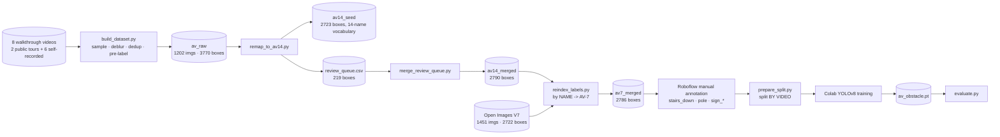

# Assistive Vision — Project Review Deck Content

**Priority-Aware Assistive Vision for Indoor Navigation of the Visually Impaired**
Dept. of CSE, ATMECE Mysuru · 2025–26

> **How to use this document.** Each `### Slide N` block is one slide. Bold lines are
> bullet text; indented lines are speaker notes. Anything marked **`[PENDING]`** is a
> number that does not exist yet — fill it after the annotation and training runs.
> Do not present a `[PENDING]` as a result; the review panel will ask how you measured it.

---

## 1. Introduction

### Slide 1 — Title
- **Priority-Aware Assistive Vision for Indoor Navigation of the Visually Impaired**
- Final Year Project · Dept. of CSE, ATMECE Mysuru · 2025–26
- Team members / USNs · Guide name & designation
- Review stage: **Phase-II (Partial Implementation)**

### Slide 2 — Problem Statement
- Visually impaired people navigating unfamiliar indoor spaces — hospitals, malls, campuses — lack three things simultaneously: **what is written**, **what is in the way**, and **which of those matters first**.
- Existing assistive readers solve only the first, and only for horizontal, front-facing text.
- Real signage is rotated, angled, backlit, or a pictogram with no text at all.
- Existing tools speak findings in arbitrary order. A system that reads a shop name *before* warning about a descending staircase is not merely unhelpful — it is dangerous.

  > Speaker note: this ordering failure is the gap the project targets. Detection is a solved-ish problem; *delivery* is not.

### Slide 3 — Motivation
- WHO estimates at least 2.2 billion people live with a vision impairment.
- Indoor wayfinding is the acknowledged hard case: GPS is unavailable or too coarse, and tactile guidance is inconsistently deployed in Indian public buildings.
- A phone is the only hardware a user reliably already owns — so the solution must run on a commodity phone camera, with no wearable, no beacon, no depth sensor.

### Slide 4 — Scope of the Project
- **In scope:** indoor assistive wayfinding — obstacle awareness, signage reading, symbol recognition, prioritized speech, hands-free voice control.
- **Explicitly out of scope:** outdoor vehicle-hazard perception by the custom model; turn-by-turn street navigation (delegated to Google Maps).
- Scope boundary is enforced in software, not just documented: the system reports which detection vocabulary is active and announces when outdoor obstacle coverage is unavailable.

  > Speaker note: a stated, *enforced* scope boundary is a methodology strength. Say this out loud — panels reward it far more than an over-claimed feature list.

---

## 2. Objectives

### Slide 5 — Objectives
1. **Detect obstacles and navigation-relevant objects** from a live monocular phone camera stream in real time on commodity CPU hardware.
2. **Read environmental text** including rotated and perspective-distorted signage, via oriented region proposals with perspective rectification before OCR.
3. **Recognize navigation symbols** — washroom, exit, lift, reception, wheelchair access — including *pictogram-only* signs carrying no text, which is precisely where OCR-only assistive readers fail.
4. **Estimate distance in walking steps**, not metres or pixels — the unit a blind user can actually act on.
5. **Prioritize speech output** by safety: hazards → the user's query → symbols → environment summary.
6. **Provide full hands-free voice control** over the application lifecycle.
7. **Build a reproducible, domain-specific dataset and evaluation harness** so results are measured rather than asserted.

### Slide 6 — Objective → Deliverable Mapping
| # | Objective | Deliverable | Status |
|---|---|---|---|
| 1 | Obstacle detection | `server/detector.py` + AV-7 schema | Pipeline ✅ · trained model ⏳ |
| 2 | Oriented text | `server/text_pipeline.py` (OBB → deskew → OCR) | ✅ |
| 3 | Symbol recognition | `server/symbols.py` + 5 trained sign classes | Keyword path ✅ · trained path ⏳ |
| 4 | Step distance | `server/spatial.py` two-estimator fusion | ✅ |
| 5 | Priority speech | `server/priority.py` | ✅ |
| 6 | Voice control | `web/index.html` command router | ✅ |
| 7 | Dataset + evaluation | `scripts/` toolchain, `scripts/evaluate.py` | Tooling ✅ · annotation ⏳ |

---

## 3. System Architecture

### Slide 7 — Overall Architecture (5 layers)

```
┌──────────────────────── CLIENT (phone browser, HTTPS) ────────────────────────┐
│  INPUT      Camera capture · Microphone (STT) · GPS · Gyroscope (pitch)       │
│  OUTPUT     TTS speech · Vibration · Detection overlay · Hazard flash         │
└───────────────────────────────────┬───────────────────────────────────────────┘
                    JPEG frame + keyword + pitch + session
                                    │  HTTP POST /analyze
                                    ▼
┌──────────────────────── SERVER (FastAPI, Python) ─────────────────────────────┐
│  PRE-PROCESS   decode → resize (max 960 px) → blur gate (var. of Laplacian)   │
│                                    │                                          │
│  AI LAYER      ┌───────────────────┴────────────────────┐                     │
│                │ YOLOv8 detector      YOLO-OBB / CRAFT  │                     │
│                │ objects + hazards    → deskew → EasyOCR│                     │
│                └───────────────────┬────────────────────┘                     │
│                                    ▼                                          │
│  LOGIC LAYER   spatial (direction · proximity · steps)                        │
│                symbols (class → symbol, OCR keyword → symbol, query match)    │
│                priority (hazard-first speech builder)                         │
│                                    │                                          │
│  RESPONSE      { speech, hazard_count, hazards[], objects[], texts[],          │
│                  symbols[], match, frame, ms }                                │
└───────────────────────────────────────────────────────────────────────────────┘
```

### Slide 8 — Data Flow Between Components



### Slide 9 — Architectural Decisions Worth Defending
- **Client–server split.** Inference needs ~200 MB of model weights and torch; a phone browser cannot host that. The phone does capture and delivery, the server does perception.
- **Blocking inference in a worker thread.** `/analyze` is a synchronous handler on purpose — FastAPI runs it off the event loop, so heavy inference never freezes `/health` or a concurrent request.
- **Serialized inference (`_infer_lock`).** ML models are not thread-safe; correctness is chosen over throughput.
- **Pure-logic modules carry no ML imports.** `spatial`, `priority`, `symbols` are plain Python and therefore unit-testable without loading a model — this is why the test suite runs in ~2 s.
- **Temporal confirmation.** In live mode an object must appear in two consecutive frames before it is spoken, which suppresses single-frame false positives.

---

## 4. System Design

### Slide 10 — Use Case Diagram



### Slide 11 — Class Diagram (server modules)



### Slide 12 — Sequence Diagram (live assist loop)



### Slide 13 — Activity Diagram (priority engine)



### Slide 14 — Dataset Pipeline (ER-style data flow)



---

## 5. Partial Implementation Details

### Slide 15 — Technologies Used
| Layer | Technology | Role |
|---|---|---|
| Backend | Python 3.11, FastAPI, Uvicorn | REST API, static hosting |
| Detection | Ultralytics YOLOv8 (n/s) | Objects, obstacles, OBB text |
| OCR | EasyOCR (CRAFT detector + CRNN recognizer) | Text detection & recognition |
| Vision utils | OpenCV, NumPy | Decode, resize, blur gate, perspective deskew |
| Frontend | HTML5, CSS3, vanilla JS | Camera, overlay, UI |
| Speech | Web Speech API (SpeechSynthesis + SpeechRecognition) | TTS output, voice commands |
| Sensors | DeviceOrientation API, Geolocation API | Camera pitch, GPS |
| Testing | pytest, FastAPI TestClient, httpx | 66 automated tests |
| Deployment | Docker, Hugging Face Spaces, Cloudflare Tunnel | Hosting, HTTPS for camera access |

### Slide 16 — Module 1: Detection & Schema Safety
- YOLOv8 inference with per-class confidence gates (`person` 0.62 vs global 0.45) because noisy classes need stricter thresholds than the default.
- **Key engineering contribution:** a model is identified by its **class names**, never its filename.

  > Speaker note — this is a strong slide, spend time here. The original code inferred "this is my custom model" from the weights *path*. A COCO-class model placed at that path silently switched hazard lookup to the AV hazard set (`AV_HAZARDS`), which contains no vehicles — so cars, buses and trucks stopped being treated as hazards, with no error message. `detect_schema()` now reads the model's actual output vocabulary and refuses an unrecognised schema at startup. Silent degradation became a loud failure.

### Slide 17 — Module 2: Oriented Text Pipeline
- Dual-path design: fine-tuned **YOLOv8-OBB** proposals when available, else EasyOCR's **CRAFT** detector, which natively returns quadrilaterals for rotated text.
- Each oriented quad is **perspective-rectified** (`cv2.getPerspectiveTransform` + `warpPerspective`) to a horizontal patch before recognition — OCR accuracy on angled signage degrades sharply without this step.
- Identical output schema from both paths, so the rest of the pipeline is unaware which detector ran.

### Slide 18 — Module 3: Spatial Guidance (Algorithm)
**Direction** — frame divided into thirds → *on your left* / *straight ahead* / *on your right*.

**Step-distance — two independent monocular estimators, conservatively fused:**

```
f_px = (frame_h / 2) / tan(VFOV / 2)

E1  Height model      Z = f_px · H_class / h_box        (needs known class height)
E2  Ground plane      θ = atan((y_bottom − c_y)/f_px) + pitch
                      Z = h_camera / tan(θ)             (uses floor-contact point)

Z_final = min(E1, E2)          ← conservative: assume the closer estimate
steps   = round(Z_final / 0.75 m)
```

- `min()` is deliberate: for a blind user, under-estimating distance is safe and over-estimating is not.
- Gyroscope pitch corrects E2 for phone tilt; per-device VFOV calibration (place a chair 4 steps away, tap) solves the true field of view and persists it.
- Special case: a box touching the frame bottom with large area ⇒ object at the user's feet ⇒ 1 step.

  > Speaker note — defect found and fixed: frame area was derived from height alone assuming 16:9, which overstated the denominator by **216% on a portrait frame**. The at-your-feet trip warning therefore never fired on a phone held upright, which is how phones are actually held. Our own footage is 576×1024 portrait, so the bug was live on every recorded frame.

### Slide 19 — Module 4: Symbol Recognition
- Two resolution paths: **detected class → symbol**, and **OCR keyword → symbol**.
- Whole-word matching via regex word boundaries, not substring containment.

  > Speaker note: substring matching announced a restaurant **MENU** board as a washroom, because "men" is a substring of "MENU" and "WOMEN". It also matched "exit" inside "EXITED". Both are regression-tested now.

- Voice queries are normalized by stopword stripping: *"where is the exit"* → `exit`.
- Trained-class path is prioritized over OCR, so a pictogram-only sign resolves even with zero readable text.

### Slide 20 — Module 5: Priority Engine (Core Contribution)
Strict four-tier ordering, evaluated top-down:

| Tier | Content | Example |
|---|---|---|
| 0 | **Critical** — `stairs_down` | *"Warning! stairs going down, about three steps straight ahead. Stop and proceed carefully."* |
| 1 | Hazards, closest-first | *"Caution. person, about two steps on your right."* |
| 2 | Keyword result | *"washroom is on your left, nearby."* |
| 3 | Symbols | *"Signs: emergency exit on your right."* |
| 4 | Environment summary | *"I can see: PHARMACY, chair, door."* |

- Distant hazard-class objects are **demoted** to plain objects — only close ones interrupt.
- `stairs_down` is separated from `stairs_up` in the schema by design: identical texture, opposite danger.

### Slide 21 — Module 6: Voice Interaction
- Continuous recognition with **self-echo suppression** — the microphone is paused while TTS speaks, then resumed on `onend`, so the app never transcribes its own voice.
- Command coverage: start/stop scanning, find *X*, describe surroundings, navigate to *X*, how far is *X*, repeat, mute/unmute, hazards-only, calibrate, help, close.
- Live-mode speech deduplication prevents re-announcing an unchanged scene.

### Slide 22 — Dataset Construction (Algorithm)
```
for each walkthrough video:
    sample 1 frame every 2 seconds (0.5 fps)
    reject if variance_of_Laplacian(gray) < 60        # motion blur
    reject if hamming(aHash(frame), aHash(prev)) < 6  # near-duplicate
    pre-label with YOLOv8s → YOLO-format .txt
```
- Result: **1202 frames** retained from **8 videos** (2 public walking tours + 6 self-recorded) across malls, hospitals and campuses.
- Pre-labelling means the annotator **corrects** rather than **draws**, which is far faster.
- `remap_to_av14.py` auto-converts **2723 of 3770 boxes (72%)** to the AV vocabulary and queues **219 ambiguous boxes** for human adjudication (all 219 adjudicated).

### Slide 23 — A Dataset Defect We Caught Before It Cost Us
- Pre-labels carry **COCO class indices**; Roboflow imports by index against the new 14-name list. The indices collide:

| COCO idx | actually is | AV idx | would become |
|---|---|---|---|
| 2 | car | 2 | **table** |
| 5 | bus | 5 | **dustbin** |
| 6 | train | 6 | **signboard** |
| 7 | truck | 7 | **stairs_down** |

- Following the naïve import would have injected **9 phantom `stairs_down` boxes** — into the single most safety-critical class in the system, invisible to any accuracy metric.
- Mitigation: vehicle boxes are **deleted**, not remapped, and the remap tool enforces this programmatically.

  > Speaker note: this is an excellent slide for a review panel. It demonstrates dataset engineering rigour, not just model usage.

---

## 6. Partial Testing

### Slide 24 — Test Strategy
- **146 automated tests, all passing**, executing in ~40 s in a clean venv (no model download required).
- Pure-logic modules are ML-free by design, which is what makes fast, deterministic testing possible.
- Every fixed defect is pinned by a regression test, so it cannot silently return.

| Test module | Tests | Covers |
|---|---|---|
| `test_pipeline_logic.py` | 40 | spatial, priority, symbols, schema detection |
| `test_prepare_split.py` | 21 | by-video split, data.yaml schema, sparse-class refusal |
| `test_api_limits.py` | 18 | upload cap, rate limit, session bounds, /health |
| `test_remap.py` | 18 | COCO→AV index rewrite, review queue |
| `test_merge_review_queue.py` | 10 | adjudication merge |
| `test_reindex_labels.py` | 10 | by-name reindex to AV-7 |
| `test_review_crops.py` | 9 | crop review tool |
| `test_obb_converters.py` | 7 | ICDAR/SynthText/COCO-Text → OBB, non-OBB refusal |
| `test_evaluate.py` | 6 | percentiles, graceful degradation |
| `test_train_colab_gate.py` | 5 | coverage gate before a GPU run |
| `test_build_dataset.py` | 2 | non-ASCII filename handling |
| **Total** | **146** | |

### Slide 25 — Representative Test Cases
| # | Test case | Input | Expected | Result |
|---|---|---|---|---|
| T1 | Direction thirds | box at x=100 of 900 | `on your left` | ✅ |
| T2 | Step monotonicity | larger box vs smaller | nearer < farther | ✅ |
| T3 | Feet detection (portrait) | box touching bottom, 720×1280 | 1 step | ✅ |
| T4 | Hazard-first ordering | car + PHARMACY sign | speech starts `Caution.` | ✅ |
| T5 | Critical hazard | lone `stairs_down` | starts `Warning!`, `hazard_count == 1` | ✅ |
| T6 | Substring rejection | keyword `washroom` vs `MENU` | no match | ✅ |
| T7 | Whole-word match | keyword `exit` vs `FIRE EXIT` | match | ✅ |
| T8 | Schema guard | COCO model at custom path | resolves as `coco`, vehicles stay hazards | ✅ |
| T9 | Unknown schema | 2-class model | `ValueError` raised at load | ✅ |
| T10 | Oversized upload | body > 8 MB | HTTP 413 | ✅ |

### Slide 26 — Performance Metrics
**Measured (real):**
- Test suite runtime: **~40 s**, 146 tests
- Frame transport size: ~150 KB per frame at 960 px, JPEG q0.8
- Live-assist cadence: 2.6 s per cycle
- COCO baseline measured 2026-08-29 with `scripts/evaluate.py --weights yolov8n.pt --data datasets/av7_split/data.yaml --limit 200` on a laptop CPU (`runs/eval/coco_baseline.md`, val = 4 held-out phone videos + Open Images val): hazard-frame recall 0.236 at precision 0.875 — COCO yolov8n at the deployed 0.62 person gate misses most people in phone footage and cannot see doors, stairs or dustbins at all. Full-pipeline latency p50 3.9 s on an idle CPU, of which EasyOCR is 3.8 s and YOLOv8n 0.14 s.
- **Preliminary AV-7 fine-tune trained 2026-08-29** (`scripts/train_local_baseline.py`: YOLOv8n, 640 px, 12 epochs, ~4 h on this CPU) → `models/av_obstacle_candidate.pt`, evaluated in `runs/eval/av7_local.md`. It is deliberately **not** installed as `models/av_obstacle.pt`; the final model is the Colab run (YOLOv8s, 832 px, 120 epochs).

**Measured on the AV-7 val split** (350 images / 691 boxes, 4 held-out phone videos + Open Images val):

| Metric | COCO baseline | AV-7 preliminary (YOLOv8n, 12 ep) | AV-7 final (YOLOv8s, 120 ep) |
|---|---|---|---|
| mAP@50 | undefined (COCO vocabulary vs AV-7 labels) | **0.293** | `[PENDING]` |
| mAP@50-95 | undefined | **0.177** | `[PENDING]` |
| AP `stairs_down` | n/a (no class) | n/a until annotated | n/a until annotated |
| AP `sign_*` (mean) | n/a (no class) | n/a until annotated | n/a until annotated |
| Hazard-frame recall | 0.236 (P 0.875, F1 0.372) | **0.527** (P 0.987, F1 0.687) | `[PENDING]` |
| Latency p50 / p90 (CPU, full pipeline) | 4,262 / 6,486 ms | **3,330 / 4,016 ms** | `[PENDING]` |
| Detector alone, p50 | 321 ms | **102 ms** | `[PENDING]` |

Per-class AP50 of the preliminary model, printed beside its support — the three
classes COCO cannot express at all are where the fine-tune earns its place:

| class | AP50 | val boxes | COCO recall → AV-7 recall (deployed thresholds) |
|---|---|---|---|
| `dustbin` | 0.766 | 30 | 0.000 → **0.909** |
| `stairs_up` | 0.463 | 46 | 0.000 → **0.375** |
| `door` | 0.358 | 288 | 0.000 → **0.317** |
| `chair` | 0.289 | 28 | 0.471 → 0.294 |
| `person` | 0.162 | 266 | 0.164 → 0.073 |
| `table` | 0.011 | 17 | 0.250 → 0.000 |
| `signboard` | 0.000 | 16 | 0.000 → 0.000 |

  > Speaker note: report the regression, do not hide it. `person` drops because COCO carries millions of person boxes and we have 2,533 indoor ones; `table`/`signboard` have too few boxes to learn (the harness flags any class under 30 val boxes as noise). The frame-level hazard gain is real and is what the user experiences. The 120-epoch YOLOv8s run is expected to recover `person`; that model, not this one, is what gets deployed.

### Slide 27 — Evaluation Methodology (Why Our Numbers Will Be Trustworthy)
- **Split by video, never by frame.** Consecutive 1 fps frames from one walkthrough are near-identical; a random frame split leaks the validation set into training and reports a fantasy mAP. Whole videos are held out, and the harness re-proves disjointness on every run.
- **Self-evaluation is refused.** The pre-labels were generated *by* YOLOv8s. Scoring a YOLO model against them measures agreement between two checkpoints, not accuracy — the harness detects this and refuses without an explicit override.
- **Support is printed beside every metric.** With `person` at 66.6% of boxes, a class with 5 examples must never be read as a result.
- **Operating-point metrics separate from mAP.** mAP is measured at conf≈0.001 and bypasses the deployed thresholds, so it reports model capacity, not system accuracy. Both are reported, labelled distinctly.

### Slide 28 — Current Dataset Status (Honest)
Split as built on 2026-08-29 (`datasets/av7_split`, train / val boxes):

| Class | Train | Val | Source |
|---|---|---|---|
| `person` | 2533 | 266 | auto-remapped + Open Images |
| `door` | 604 | 288 | Open Images |
| `dustbin` | 730 | 30 | Open Images |
| `stairs_up` | 534 | 46 | Open Images |
| `chair` | 277 | 28 | auto-remapped + Open Images |
| `table` | 75 | 17 | auto-remapped + Open Images |
| `signboard` | 34 | 16 | adjudicated review queue |
| `stairs_down`, `pole`, `sign_washroom`, `sign_exit`, `sign_lift`, `sign_reception`, `sign_wheelchair` | **0** | **0** | manual annotation pending |

- 1,726 train / 350 val frames (4 self-recorded videos held out); all 219 review-queue boxes adjudicated.
- The 7 empty classes have **no COCO or Open Images equivalent** — that is *why* the custom schema exists, and it is the irreducible manual step. `stairs_down` is the critical one: 474 Open Images stairs pictures are queued in `datasets/oi_av14/review_stairs.txt` for up/down re-tagging.

---

## 7. Conclusion and Future Enhancements

### Slide 29 — Work Completed
- End-to-end working system: capture → detection → OCR → spatial reasoning → prioritized speech → TTS, deployable via Docker and reachable over HTTPS from any phone.
- Priority engine, spatial estimator, symbol matcher and voice interface fully implemented and regression-tested (146 tests).
- Complete dataset toolchain: extraction, deduplication, pre-labelling, schema remapping, review queue, leakage-safe splitting, evaluation harness.
- Three safety-relevant defects identified and fixed with pinned regressions: filename-based schema inference, the portrait aspect-ratio failure in feet detection, and unbounded request handling.
- 1202 frames curated from 8 real walkthrough videos; 72% of pre-labels auto-converted to the target schema, the remaining 219 adjudicated by hand.

### Slide 30 — Work Remaining
1. Manual annotation of the 7 unpopulated classes in Roboflow — `stairs_down` first, then `pole` and the five `sign_*` (the critical path).
2. Re-import of the one remaining self-recorded video (`b532ffc4…`, 215 labelled frames).
3. Colab training run (YOLOv8s, imgsz=832) and deployment of `av_obstacle.pt`.
4. Colab training run (YOLOv8s, 832 px, 120 epochs) and re-execution of the evaluation harness to populate the final-model column.
5. YOLOv8-OBB text detector fine-tuned on ICDAR-2015 (optional upgrade path).

### Slide 31 — Future Enhancements
- **Metric depth** via MiDaS/DepthAnything monocular estimation, replacing the class-height heuristic and removing dependence on known object heights.
- **Object tracking** (ByteTrack) so temporal confirmation matches by position rather than by class label alone — currently a different person in a different place counts as confirmed.
- **On-device inference** (TFLite / ONNX Runtime Web) to remove the server round trip and the network dependency.
- **Indoor positioning** via BLE beacons or visual place recognition, enabling true indoor turn-by-turn rather than relative guidance.
- **Multilingual OCR and TTS** — Kannada and Hindi signage is common in the target deployment environment.
- **Trained pictogram classifier** expanded beyond five sign classes to the full ISO 7001 symbol set.
- **User study** with visually impaired participants measuring task-completion time against an unprioritized baseline, plus SUS scoring.

### Slide 32 — Conclusion
- The project delivers a working, tested, deployable assistive navigation pipeline whose distinguishing contribution is **prioritized delivery** — ordering what is spoken by safety rather than by detection order.
- Engineering rigour is demonstrated not only by features implemented but by defects found and prevented, several of which would have silently degraded safety behaviour in ways no accuracy metric would reveal.
- The remaining work is well-defined, tooled end-to-end, and on the critical path to a complete evaluation.

---

## 8. References

> Verify volume/page details against IEEE format before final submission.

1. J. Redmon, S. Divvala, R. Girshick, and A. Farhadi, "You Only Look Once: Unified, Real-Time Object Detection," *Proc. IEEE CVPR*, 2016.
2. G. Jocher, A. Chaurasia, and J. Qiu, "Ultralytics YOLOv8," 2023. [Online]. Available: https://github.com/ultralytics/ultralytics
3. Y. Baek, B. Lee, D. Han, S. Yun, and H. Lee, "Character Region Awareness for Text Detection (CRAFT)," *Proc. IEEE CVPR*, 2019.
4. X. Zhou et al., "EAST: An Efficient and Accurate Scene Text Detector," *Proc. IEEE CVPR*, 2017.
5. M. Liao, Z. Wan, C. Yao, K. Chen, and X. Bai, "Real-time Scene Text Detection with Differentiable Binarization," *Proc. AAAI*, 2020.
6. B. Shi, X. Bai, and C. Yao, "An End-to-End Trainable Neural Network for Image-based Sequence Recognition (CRNN)," *IEEE TPAMI*, vol. 39, no. 11, 2017.
7. D. Karatzas et al., "ICDAR 2015 Robust Reading Competition," *Proc. ICDAR*, 2015.
8. T.-Y. Lin et al., "Microsoft COCO: Common Objects in Context," *Proc. ECCV*, 2014.
9. World Health Organization, "Blindness and vision impairment," WHO Fact Sheet, 2023.
10. ISO 7001:2023, "Graphical symbols — Public information symbols," International Organization for Standardization.
11. R. Ranftl, K. Lasinger, D. Hafner, K. Schindler, and V. Koltun, "Towards Robust Monocular Depth Estimation (MiDaS)," *IEEE TPAMI*, 2022.
12. World Wide Web Consortium, "Web Speech API Specification," W3C Community Group Report.

---

## 9. Status of Paper Publication Work

### Slide 33 — Publication Status
- **Working title:** *Priority-Aware Assistive Vision: Oriented Text Detection, Metric Step-Distance Estimation, and Hands-Free Voice Interaction for Visually Impaired Navigation*
- **Current stage:** Draft prepared — abstract, contributions, related-work positioning and architecture sections written; **results sections held open pending measured numbers**.
- **Target venues (under consideration):** IEEE Access · IEEE Sensors Journal · IEEE Trans. on Human-Machine Systems; conference route via IEEE ICASSP / EMBC / ICCE.

### Slide 34 — Claimed Contributions (for the paper)
| ID | Contribution | Status |
|---|---|---|
| C1 | Domain-specific 7-class indoor navigation schema (14-name annotation vocabulary) with hazard roles assigned in code rather than by annotation | Schema ✅ · trained model ⏳ |
| C2 | Step-metric spatial guidance via dual-estimator monocular fusion with per-device calibration | ✅ |
| C3 | Priority-aware speech scheduler with safety-ordered output | ✅ |
| C4 | Full-lifecycle hands-free voice interaction with self-echo suppression | ✅ |
| C5 | Reproducible dataset pipeline with leakage-safe evaluation | ✅ |

### Slide 35 — Path to Submission
1. Complete annotation and training → populate all result tables.
2. Run the before/after comparison (COCO baseline vs AV-7 fine-tune) — the harness generates this in one command.
3. Conduct the user study for the C3 claim (task-completion time vs unprioritized baseline).
4. Internal review with guide → formatting to IEEE template → submission.

- **Integrity commitment:** every reported number will be measured on our own data with training logs and weights retained. No literature numbers will be reported as our own results.

  > Speaker note: state this explicitly to the panel. It pre-empts the most common and most damaging question — "how did you get this number?"
